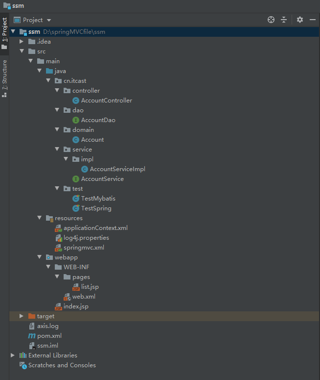
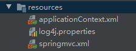
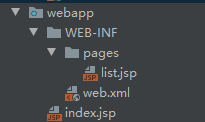

# SSM框架整合

​	整个程序的框架结构为：



### Account类：

```java
package cn.itcast.domain;

import java.io.Serializable;

/**
 * 账户
 */
public class Account implements Serializable {

    private Integer id;
    private String name;
    private Double money;

    public Integer getId() {
        return id;
    }

    public void setId(Integer id) {
        this.id = id;
    }

    public String getName() {
        return name;
    }

    public void setName(String name) {
        this.name = name;
    }

    public Double getMoney() {
        return money;
    }

    public void setMoney(Double money) {
        this.money = money;
    }

    @Override
    public String toString() {
        return "Account{" +
                "id=" + id +
                ", name='" + name + '\'' +
                ", money=" + money +
                '}';
    }
}
```

​	创建Account类作为javabean，实现序列化接口Serializable，Account类内含3个属性，id,name和money，分别实现get/set方法和toString()方法。

### AccountService接口及其实现类

#### 1.AccountService接口

```java
package cn.itcast.service;

import cn.itcast.domain.Account;

import java.util.List;

public interface AccountService {

    /**
     * 查询所有账户
     * @return
     */
    public List<Account> findAll();

    /**
     * 保存账户信息
     * @param account
     */
    public void savaAccount(Account account);
}

```

​	AccountService接口中定义两个方法，findAll()和savaAccount()。

#### 2.AccountService实现类

```java
package cn.itcast.service.impl;

import cn.itcast.dao.AccountDao;
import cn.itcast.domain.Account;
import cn.itcast.service.AccountService;
import org.springframework.beans.factory.annotation.Autowired;
import org.springframework.stereotype.Service;

import java.util.List;

@Service("accountService")
public class AccountServiceImpl implements AccountService {

    @Autowired
    private AccountDao accountDao;

    @Override
    public List<Account> findAll() {
        System.out.println("业务层：查询所有账户。。。");
        return accountDao.findAll();
    }

    @Override
    public void savaAccount(Account account) {
        System.out.println("业务层：保存账户。。。");
        accountDao.savaAccount(account);
    }
}

```

### dao接口

```java
package cn.itcast.dao;

import cn.itcast.domain.Account;
import org.apache.ibatis.annotations.Insert;
import org.apache.ibatis.annotations.Select;
import org.springframework.stereotype.Repository;

import java.util.List;

/**
 * 账户dao接口
 */
@Repository
public interface AccountDao {

    /**
     * 查询所有账户
     * @return
     */
    @Select("select * from account")
    public List<Account> findAll();

    /**
     * 保存账户信息
     * @param account
     */
    @Insert("insert into account (name,money) values (#{name},#{money})")
    public void savaAccount(Account account);

}
```

### AccountController类

```java
package cn.itcast.controller;

import cn.itcast.domain.Account;
import cn.itcast.service.AccountService;
import org.springframework.beans.factory.annotation.Autowired;
import org.springframework.stereotype.Controller;
import org.springframework.ui.Model;
import org.springframework.web.bind.annotation.RequestMapping;

import javax.servlet.http.HttpServletRequest;
import javax.servlet.http.HttpServletResponse;
import java.io.IOException;
import java.util.List;

/**
 * 账户web
 */
@Controller
@RequestMapping("/account")
public class AccountController {

    @Autowired
    private AccountService accountService;

    @RequestMapping("/findAll")
    public String findAll(Model model){
        System.out.println("表现层，查询所有账户信息...");
        // 调用业务层方法
        List<Account> list = accountService.findAll();
        model.addAttribute("list",list);
        return "list";
    }

    /**
     * 保存
     * @param account
     * @return
     */
    @RequestMapping("/save")
    public void save(Account account, HttpServletResponse response, HttpServletRequest request) throws Exception {
        System.out.println("表现层，保存...");
        accountService.savaAccount(account);
        // 保存完成后进行重定向
        response.sendRedirect(request.getContextPath()+"/account/findAll"); // 项目名+/user/findAll
        return ;
    }
}

```

### resources文件夹

​	resources文件夹下包含整个项目的配置文件，在SSM整合项目中包含三个文件，分别为applicationContext.xml，log4j.properties和springmvc.xml。



​	其中，applicationContext.xml用来配置Spring，并实现Spring整合Mybatis框架。主要实现的功能为：开启注解扫描，设定不扫描Controller；配置c3p0数据库连接池；配置SqlSessionFactory工厂；配置AccountDao所在包；配置Spring框架声明式事务管理，分别包括配置事务管理器、配置事务通知和配置AOP增强。其具体代码和相应注释如下：

```xml
<?xml version="1.0" encoding="UTF-8"?>
<beans xmlns="http://www.springframework.org/schema/beans"
       xmlns:xsi="http://www.w3.org/2001/XMLSchema-instance"
       xmlns:context="http://www.springframework.org/schema/context"
       xmlns:aop="http://www.springframework.org/schema/aop"
       xmlns:tx="http://www.springframework.org/schema/tx"
       xsi:schemaLocation="http://www.springframework.org/schema/beans
    http://www.springframework.org/schema/beans/spring-beans.xsd
    http://www.springframework.org/schema/context
    http://www.springframework.org/schema/context/spring-context.xsd
    http://www.springframework.org/schema/aop
    http://www.springframework.org/schema/aop/spring-aop.xsd
    http://www.springframework.org/schema/tx
    http://www.springframework.org/schema/tx/spring-tx.xsd">

    <!--开启注解扫描，希望处理service和dao，而不处理controller-->
    <context:component-scan base-package="cn.itcast">
        <!--配置不扫描控制器-->
        <context:exclude-filter type="annotation" expression="org.springframework.stereotype.Controller"/>
    </context:component-scan>

    <!--spring整合mybatis框架-->
    <!--配置数据库连接池-->
    <bean id="dataSource" class="com.mchange.v2.c3p0.ComboPooledDataSource">
        <property name="driverClass" value="com.mysql.jdbc.Driver"/>
        <property name="jdbcUrl" value="jdbc:mysql:///ssm"/>
        <property name="user" value="root"/>
        <property name="password" value="123456"/>
    </bean>

    <!--配置sqlSession工厂-->
    <bean id="sqlSessionFactory" class="org.mybatis.spring.SqlSessionFactoryBean">
        <property name="dataSource" ref="dataSource"/>
    </bean>

    <!--配置AccountDao所在包
        MapperScannerConfigurer 的作用是取代手动添加 Mapper ，自动扫描完成接口代理
    -->
    <bean id="mapperScanner" class="org.mybatis.spring.mapper.MapperScannerConfigurer">
        <property name="basePackage" value="cn.itcast.dao"/>
    </bean>

    <!--配置spring框架声明式事务管理-->
    <!--配置事务管理器-->
    <bean id="transactionManager" class="org.springframework.jdbc.datasource.DataSourceTransactionManager">
        <property name="dataSource" ref="dataSource"/>
    </bean>

    <!--配置事务通知-->
    <tx:advice id="txAdvice" transaction-manager="transactionManager">
        <tx:attributes>
            <tx:method name="find*" read-only="true"/>
            <tx:method name="*" isolation="DEFAULT"/>
        </tx:attributes>
    </tx:advice>

    <!--配置AOP增强-->
    <aop:config>
        <aop:advisor advice-ref="txAdvice" pointcut="execution(* cn.itcast.service.impl.*ServiceImpl.*(..))"/>
    </aop:config>

</beans>
```

​	springmvc.xml主要进行SpringMvc的配置，主要实现以下功能：开启注解扫描，仅扫描Controller类；配置视图解析器对象；过滤静态资源；开启SpringMvc对注解的支持。其具体代码和相应注释如下：

```xml
<?xml version="1.0" encoding="UTF-8"?>
<beans xmlns="http://www.springframework.org/schema/beans"
       xmlns:mvc="http://www.springframework.org/schema/mvc"
       xmlns:context="http://www.springframework.org/schema/context"
       xmlns:xsi="http://www.w3.org/2001/XMLSchema-instance"
       xsi:schemaLocation="
    http://www.springframework.org/schema/beans
    http://www.springframework.org/schema/beans/spring-beans.xsd
    http://www.springframework.org/schema/mvc
    http://www.springframework.org/schema/mvc/spring-mvc.xsd
    http://www.springframework.org/schema/context
    http://www.springframework.org/schema/context/spring-context.xsd">

    <!--开启注解扫描-->
    <context:component-scan base-package="cn.itcast">
        <context:include-filter type="annotation" expression="org.springframework.stereotype.Controller"/>
    </context:component-scan>

    <!--配置视图解析器对象-->
    <bean id="internalResourceViewResolver" class="org.springframework.web.servlet.view.InternalResourceViewResolver">
        <property name="prefix" value="/WEB-INF/pages/"/>
        <property name="suffix" value=".jsp"/>
    </bean>

    <!--过滤静态资源-->
    <mvc:resources mapping="/css/" location="/css/**"/>
    <mvc:resources mapping="/images/" location="/images/**"/>
    <mvc:resources mapping="/js/" location="/js/**"/>

    <!--开启springmvc对注解的支持-->
    <mvc:annotation-driven/>

</beans>
```

### webapp文件夹

​	webapp文件夹的结构如下图所示。其中WEB-INF/pages/list.jsp是视图解析器的跳转页面，index.jsp为服务器加载后默认打开的界面，web.xml为SpringMvc的另一个配置文件。



​	list.jsp代码如下。在该程序中，首先设置isELIgnored="false"，开启对EL表达式的支持。随后，引入遍历所需的包，<%@taglib prefix="c" uri="http://java.sun.com/jsp/jstl/core" %>。EL表达式通过<c:foreach>遍历由AccountService的findAll()方法存入request域中的list对象

```jsp
<%--
  Created by IntelliJ IDEA.
  User: Administrator
  Date: 2021/1/12
  Time: 22:28
  To change this template use File | Settings | File Templates.
--%>
<%@ page contentType="text/html;charset=UTF-8" language="java"  isELIgnored="false" %>
<%--引入遍历所需的包--%>
<%@taglib prefix="c" uri="http://java.sun.com/jsp/jstl/core" %>
<html>
<head>
    <title>Title</title>
</head>
<body>
        <h3>查询所有的账户</h3>

        <%--${list}--%>
        <c:forEach items="${list}" var="account">
            ${account.name}
        </c:forEach>
</body>
</html>
```

​	index.jsp为服务器加载时默认进入的界面，在该项目中，界面上设置有一个超链接和一个表单。代码为：

```jsp
<%--
  Created by IntelliJ IDEA.
  User: Administrator
  Date: 2021/1/12
  Time: 22:34
  To change this template use File | Settings | File Templates.
--%>
<%@ page contentType="text/html;charset=UTF-8" language="java" %>
<html>
<head>
    <title>Title</title>
</head>
<body>
    <a href="account/findAll">测试查询</a>

    <form action="account/save" method="post">
        姓名：<input type="text" name="name"><br>
        金额：<input type="text" name="money"><br>
        <input type="submit" value="保存"><br>
    </form>
</body>
</html>
```

​	web.xml为SpringMvc的另一个配置文件，里面主要实现下述功能：配置Spring的监听器，在启动服务器的时候，除了加载SpringMvc的配置文件，还利用监听器加载Spring的配置文件。但监听器默认只加载WEB-INF目录下面的applicationContext.xml配置文件。该问题有两个解决方法，一是复制applictionContext.xml到WEB-INF下，此种方法不智能；二是使用context-param更改加载的配置路径。

​	此外，web.xml还配置了前端控制器，前端控制器为一个Servlet。前端控制器对客户端发来的请求进行拦截，拦截后利用Controller进行控制，本项目中采用AccountController进行控制。在前端控制器中，还需配置init-param，用来加载springmvc.xml配置文件。随后，利用load-on-startup对该Servlet和服务器进行绑定，服务器启动，则启动该Servlet。

​	最后，前端控制器配置了过滤器，用来解决中文乱码的问题。

​	web.xml的代码如下：

```xml
<!DOCTYPE web-app PUBLIC
 "-//Sun Microsystems, Inc.//DTD Web Application 2.3//EN"
 "http://java.sun.com/dtd/web-app_2_3.dtd" >

<web-app>
  <display-name>Archetype Created Web Application</display-name>

  <!--配置spring的监听器，默认只加载WEB-INF目录下面的applicationContext.xml配置文件-->
  <listener>
    <listener-class>org.springframework.web.context.ContextLoaderListener</listener-class>
  </listener>

  <!--针对上述问题，有两种解决方式
      1.复制applictionContext.xml到WEB-INF下
      2.使用context-param更改加载的配置路径
  -->
  <context-param>
    <param-name>contextConfigLocation</param-name>
    <param-value>classpath:applicationContext.xml</param-value>
  </context-param>

  <!--配置前端控制器-->
  <servlet>
    <servlet-name>dispatcherServlet</servlet-name>
    <servlet-class>org.springframework.web.servlet.DispatcherServlet</servlet-class>
    <!--加载springmvc.xml配置文件-->
    <init-param>
      <param-name>contextConfigLocation</param-name>
      <param-value>classpath:springmvc.xml</param-value>
    </init-param>
    <!--创建服务器，启动该servlet-->
    <load-on-startup>1</load-on-startup>
  </servlet>
  <servlet-mapping>
    <servlet-name>dispatcherServlet</servlet-name>
    <url-pattern>/</url-pattern>
  </servlet-mapping>

  <!--配置过滤器，解决中文乱码的问题-->
  <filter>
    <filter-name>characterEncodingFilter</filter-name>
    <filter-class>org.springframework.web.filter.CharacterEncodingFilter</filter-class>
    <init-param>
      <param-name>encoding</param-name>
      <param-value>UTF-8</param-value>
    </init-param>
  </filter>
  <filter-mapping>
    <filter-name>characterEncodingFilter</filter-name>
    <url-pattern>/*</url-pattern>
  </filter-mapping>

</web-app>
```

​	目前项目的整个框架结构已陈述，关于注解的部分将在下一次加上。